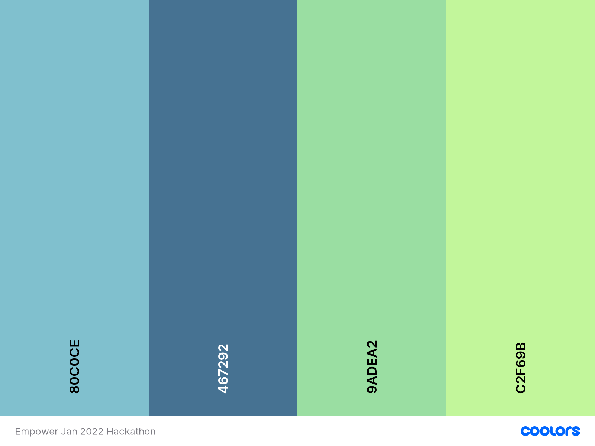

# Empower Website

Information about the website and hackathon to go here.

Add site responsive screenshot here

Link to deployed site to go here

Add the w3c validator shields badge here - is there a badge for python validator?

## CONTENTS

* [User Experience (UX)](#User-Experience-(UX))
  * [Initial Discussion](#Initial-Discussion)
  * [User Stories](#User-Stories)

* [Design](#Design)
  * [Colour Scheme](#Colour-Scheme)
  * [Typography](#Typography)
  * [Imagery](#Imagery)
  * [Wireframes](#Wireframes)
  * [Features](#Features)
  * [Accessibility](#Accessibility)

* [Technologies Used](#Technologies-Used)
  * [Languages Used](#Languages-Used)
  * [Frameworks, Libraries & Programs Used](#Frameworks,-Libraries-&-Programs-Used)

* [Deployment & Local Development](#Deployment-&-Local-Development)
  * [Deployment](#Deployment)
  * [Local Development](#Local-Development)
    * [How to Fork](#How-to-Fork)
    * [How to Clone](#How-to-Clone)

* [Testing](#Testing)
  * [W3C Validator](#W3C-Validator)
  * [PEP8online Python Validator](PEP8online-Python-Validator)
  * [Responsiveness](#Responsiveness)
  * [Compatibility](#Compatibility)
  * [Solved Bugs](#Solved-Bugs)
  * [Known Bugs](#Known-Bugs)
  * [Testing User Stories](#Testing-User-Stories)
  * [Lighthouse](#Lighthouse)
  * [Full Testing](#Full-Testing)
  
* [Credits](#Credits)
  * [Code Used](#Code-Used)
  * [Content](#Content)
  * [Media](#Media)
  * [Collaborators](#Collaborators)
  * [Acknowledgments](#Acknowledgments)

- - -

## User Experience (UX)

### Initial Discussion

#### Key information for the site

### User Stories

1. As a user I want to be able to easily find out what the site does.
2. As a user I want to ensure that my personal information (login details and feelings log) will be kept secure and private.
3. As a user I want to be able to choose an appropriate emoticon to select as my emotional status for that day.
4. As a user I would like to be able to add additional notes to my emoticon to allow me to express my state of mind.
5. As a user I want to be able to view my previous emoticons and notes over a selected time frame to get an overview of my mental health.

- - -

## Design

### Colour Scheme

We researched colour theory and colour psychology to find what colour palettes may be beneficial to someone who may be struggling with their mental health. We discovered that light blues are associated with peace, sincerity and gentleness. Darker blues are representative of power, strength and dependability. Greens are associated with growth and have a calming presence.  

We feel that this colour palette has a nice balance between the blues and greens to promote calm and peacefulness on the site. The choice of green also ties in with the use of the colour green in the mental health awareness ribbon.

[Psychology of Color Explained](https://www.masterclass.com/articles/psychology-of-color-explained#4-examples-of-color-psychology)
 | [Colour Psychology - Green](https://www.verywellmind.com/color-psychology-green-2795817) | [Colour Psychology - Blue](https://www.verywellmind.com/the-color-psychology-of-blue-2795815)

### Typography

### Imagery

### Wireframes

Wireframes were created for mobile, tablet and desktop.

Wireframes links/images to go here

### Features

The website is comprised of …

* All Pages on the website have:

* Future Implementations.

### Accessibility

We have been mindful during coding to ensure that the website is as accessible friendly as possible. This has been have achieved by:

* Using semantic HTML.
* Using descriptive alt attributes on images on the site.
* Providing information for screen readers where there are icons used and no text.
* Ensuring that there is a sufficient colour contrast throughout the site.
* Ensuring menus are accessible by marking the current page as current for screen readers.

- - -

## Technologies Used

### Languages Used

HTML, CSS, Python

### Frameworks, Libraries & Programs Used

Balsamiq - Used to create wireframes.

Git - For version control.

Github - To save and store the files for the website.

Materialize - For the framework.

Flask -

Mongo DB -
? Font Awesome - For the iconography on the website.

Google Dev Tools - To troubleshoot and test features, solve issues with responsiveness and styling.

? [Tiny PNG](https://tinypng.com/) To compress images.

? [Birme](https://www.birme.net/) To resize images and change to webp format.

? [Favicon.io](https://favicon.io/) To create favicon.

[Am I Responsive?](http://ami.responsivedesign.is/) To show the website image on a range of devices.

[Shields.io](https://shields.io/) To add badges to the README

- - -

## Deployment & Local Development

### Deployment

The site is deployed using Heroku.

### Local Development

#### How to Fork

To fork the empowered repository:

1. Log in (or sign up) to Github.
2. Go to the repository for this project, AwsSG/empowered.
3. Click the Fork button in the top right corner.

#### How to Clone

To clone the empowered repository:

1. Log in (or sign up) to GitHub.
2. Go to the repository for this project, AwsSG/empowered.
3. Click on the code button, select whether you would like to clone with HTTPS, SSH or GitHub CLI and copy the link shown.
4. Open the terminal in your code editor and change the current working directory to the location you want to use for the cloned directory.
5. Type 'git clone' into the terminal and then paste the link you copied in step 3. Press enter.

- - -

## Testing

Testing was ongoing throughout the entire build. We utilised Chrome developer tools while building to pinpoint and troubleshoot any issues as we went along.

### W3C Validator

The W3C validator was used to validate the HTML on all pages of the website. It was also used to validate CSS in the style.css file.

W3C validator images or links to go here

### PEP8online Python Validator

### Responsiveness

Add in screenshots/gifs of responsiveness.

### Compatibility

Add in screenshots of compatibility.

### Solved Bugs

### Known Bugs

### Testing User Stories

* First Time Visitors

* Returning Visitors

* Frequent Visitors

### Lighthouse

We used Lighthouse within the Chrome Developer Tools to allow us to test the performance, accessibility, best practices and SEO of the website.

### Full Testing

To fully test my website we performed the following testing using a number of browsers (Google Chrome, Safari, Firefox, Brave) and devices (Macbook Pro 14 inch, iPhone 13 pro, …).

We also went through each page using Google Chrome developer tools to ensure that they responsive on all different screen sizes.

- - -

## Credits

### Code Used

### Content

### Media

### Collaborators

Team 3 of the January Hackathon 2022:

* [Iuliia Konovalova](https://github.com/IuliiaKonovalova)
* [Aws Sabah Gheni](https://github.com/AwsSG)
* [Theo Wright](https://github.com/theopmw)
* [Kera Cudmore](https://github.com/kera-cudmore)
* [Anna](https://github.com/ANNAhabANNA)

### Acknowledgments

We would like to acknowledge the following people who helped us along the way in completing this project:

* [Dave Bowers](https://github.com/dnlbowers), our hackathon facilitator.
